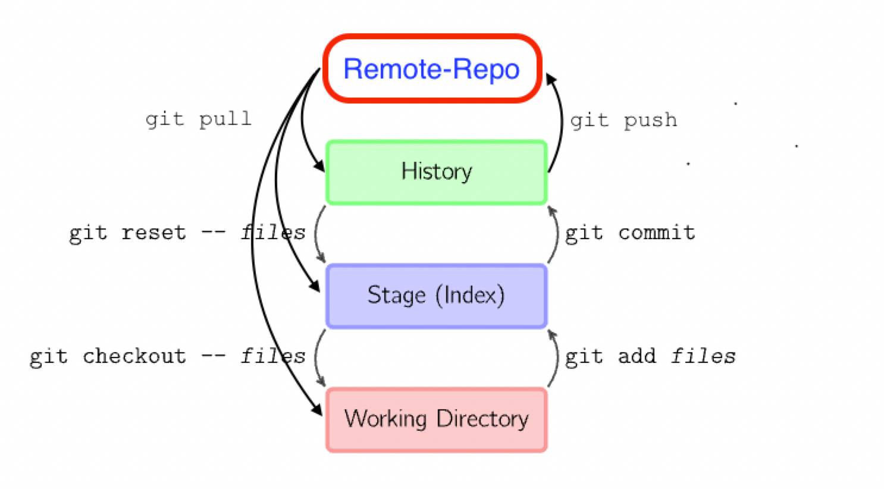
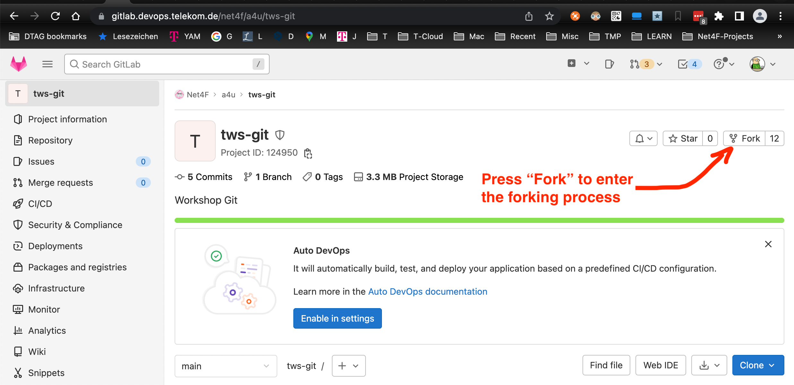
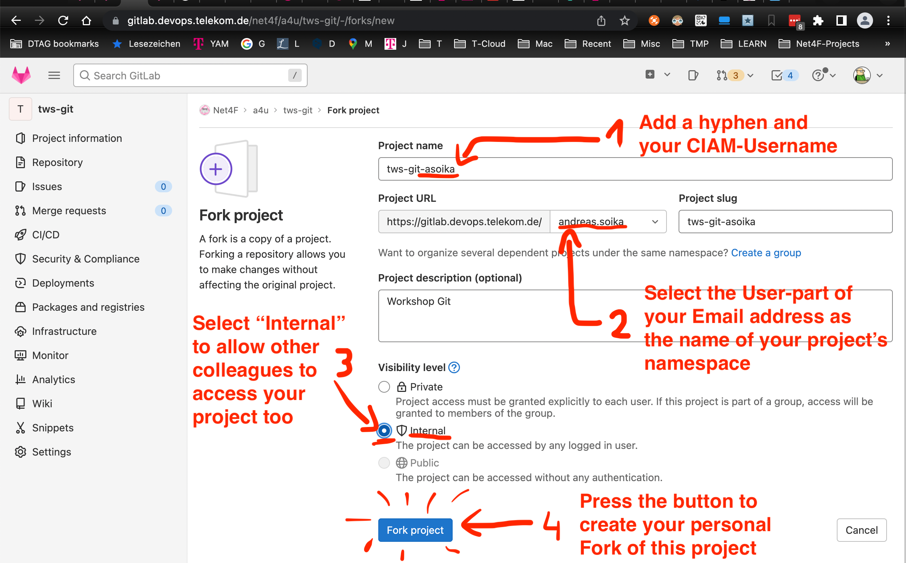
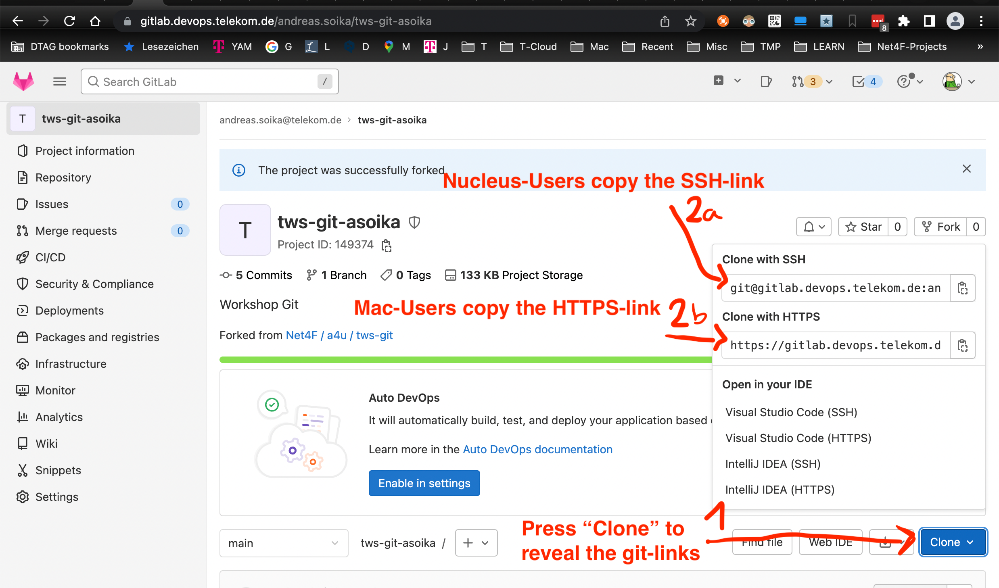
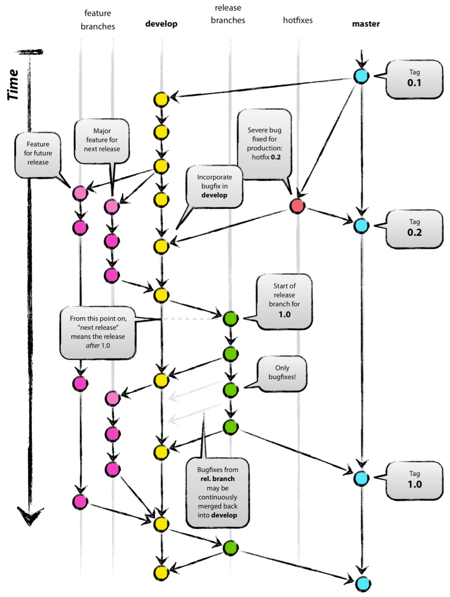

=  Workshop Git
Andreas Soika <Andreas.Soika@t-systems.com>
3.2, Nov 21, 2022: Tardis-Workshop Handout
:toc:
:sectnums:
:icons: font
:url-quickref: https://docs.asciidoctor.org/asciidoc/latest/syntax-quick-reference/

The actual document is a handout for the Tardis-Workshop.
It's used to dig into the topic of source code management
using git and GitLab.

== Git

=== Description

Git is a (source) code repository.
You need a git client to be able to access GIT repositories directly.

=== Download

The software bundle "git bash" contains the "original" git command
line tool client called "git" and can be downloaded here:
https://git-scm.com/downloads

If you do prefer another git client feel free to use your favourite git client
instead of git bash.

=== Installation

. If you own a Nucleus-PC, you can order git bash from myIT-Shop.
The respective package is named "GIT".

. If you do have admin rights and if git bash is not installed yet, download "64-bit Git for Windows Setup" from here: +
https://git-scm.com/download/win

. Start the setup program and accept any requests for access with "yes"
(by the way: in the following, we will accept all default settings, proposed by the installation routine)

. Accept the Users Licence Terms

. Select Destination Location (the default location might be fine)

. Accept the default selection of components

. Accept the default selection for Start Menu Folder

. Accept the settings for the default editor used by Git

. Accept the default setting for the name of the initial branch in new repositories

. Accept the default setting for your PATH environment

. Accept the default settings for the SSH executable

. Accept the default setting for HTTPS transport backend

. Accept the default setting for line ending conversions

. Accept the default setting for terminal emulator to use with Git Bash

. Accept the default setting for the bahavior of 'git pull'

. Accept the default setting for credential helper

. Accept the default setting for extra options
(Enable file system caching)

. Accept the default setting for experimental options (none selected)

The actual installation should start by now and leave you with an installed git bash.

===== Test your git bash installation

. Run "Git Bash" from your Start Menu

. A terminal should start

. Type in "git --version"

. You should see the version of your git client

=== Configuration

As a prerequisite for this workshop we need a working Git client,
which is configured to have access to our companies GitLab Server
(which is part of the MagentaCICD suite).

If you havn't configured your Git client (it's probably Git bash)
yet - in YAM you will find the necessary https://docs.devops.telekom.de/knowledgebase/clone-a-git-repository-from-magenta-ci-cd-to-local/[configuration instructions].

== Learning Git

=== Preamble

Before we go through the most prominent Git UseCases, I would like
to give you a few insights based on my very personal experience with Git:

. Be patient - it takes a while to learn Git.

. Do not concentrate too much on Git commands - you can look them
up on many cheatsheets. It is more important to understand the
mechanisms Git is based on.
They are key to gain deeper Git understanding.

. Once you understand Git, you can't understand any more,
why it takes other people so long to get along with this topic.
I have observed this phenomenon with many experienced programmers.
Don't be frustrated if you meet colleagues telling you, they learned
Git in one day - they just suffer from Git-amnesia.

. Personally, it took me a while to understand the principles
behind git and to learn the most basic usecases/commands by heart
(clone, checkin, checkout, reset, merge, linking local and
remote repos, ...). +
After a year (!) of Git usage I am still not an expert, but
I feel secure regarding the most common Git usecases.
+
Conclusion: do not expect to much after 1-2 hours of
speed introduction in Git.

. Don't execute Git commands, which you do not understand.
Most of the time, things get even worse.
Try to follow well known paths.

. Build up your Git knowledge step by step - whenever a new
usecase comes up to you, try to extend your knowledge: +
Write your own cheat sheet and extend it step by step
You will need this cheat sheet! According to my experience,
you will remember only those commands, which you wrote down
with your own fingers/keystrokes.

. Don't try to do fancy things with Git if you are still at the beginning.

. And my top learning at the end: #Follow the links in the reference section# -
these are not "quick & dirty first pick google links" - they are
carefully selected.
Don't waste your time poking around in the internet right at the
beginning - use my links!

=== Understanding the different git stages

Fundamental to understandig Git, is understanding the purpose
of the 4 different git stages.

Mark Lodato depicts 3 different git stages very nicely
in his "https://marklodato.github.io/visual-git-guide/index-en.html[Visual Git Reference]"

Nevertheless I would like to extend Lodato's first picture a bit
with an additional stage called "Remote-Repo":

Detailed explainations of these 4 stages - based on the image
above - is given throughout the workshop by the trainer.

=== Usecases

Within the actual tws-git project, you can find a shell
script tutorial 'gitdemo.sh' - it demonstrates
a bunch of common Git-usecases.

We have to start this shell script (gitdemo.sh) from your own fork
of the tws-git project.

The following section describes, how to fork the original
project.

==== Usecase: "Forking a repo"

In order to avoid collision between different participants of the
workshop, we fork the original repository in a preliminary step -
so everyone can do the excercises in his/her own repo:

.Forking the tws-git repo - 1st step

Define the basic project/repo settings:

.Forking the tws-git repo - 2nd step

Copy the appropriate Git - URL of your project - we will
need this information for the next usecase.

.Forking the tws-git repo - 3rd step

==== Usecase: "Cloning a repo"

Now, as you have created your own (forked) repo, you can create
a "Clone" of this repo on your local machine:

[source,bash]
----
# ----------------------------------------------------------------------------
# Intranet- & Nucleus-Users (clone via ssh):
git clone git@gitlab.devops.telekom.de:andreas.soika/tws-git-asoika.git <1>
----
<1> Please do not clone the original repo (https://gitlab.devops.telekom.de/net4f/a4u/tws-git.git) - fork the repo first
and clone your forked repo subsequently!

[source,bash]
----
# ----------------------------------------------------------------------------
# Mac/LMD-Users (clone via https):
git clone https://gitlab.devops.telekom.de/andreas.soika/tws-git-asoika.git <1>
----
<1> *Please do not clone the original repo* (https://gitlab.devops.telekom.de/net4f/a4u/tws-git.git) - fork the repo first
and clone your forked repo subsequently!

==== Start the shell-script based tutorial

Open a git-bash terminal (Mac-Users open a normal terminal) and start the shell-script based tutorial:

[source,bash]
----
# ----------------------------------------------------------------------------
# Nucleus- & Mac-Users
cd  tws-git-asoika
gitdemo.sh <1>
----
<1> *Please make sure, you are in your cloned repo* (here: "tws-git-asoika") when running this command!

Follow the instructions on the terminal. +
You might want to do your own experiments in a second terminal window. Source file gitlog.sh to have shell
function 'gitlog' at your fingertip:

[source,bash]
----
# ----------------------------------------------------------------------------
# Nucleus- & Mac-Users
cd  tws-git-asoika
source gitlog.sh    <1>
gitlog
----
<1> You have to "source" gitlog.sh to have function "gitlog"
available in your current shell.

==== Just in case: Do not fall into these Traps

===== The Whitespace-Trap

Especially windows-based workshop participants do sometimes omit
whitespaces in commands - with surprising consequences, e.g.:

----
# Correct:
echo 1 > myfile      # writes "1" into myfile
----

----
# Wrong:
echo 1> myfile       # creates myfile, but writes nothing into it
----

The wrong command will leave "myfile" with no content, since
"1>" is an independent syntax element in unix shells. It means:
"redirect stdout (not stderr) to a file". As a result, the "echo"
command is left without any parameters and does not output
anything -> an empty file "myfile" will be written down to disk.

===== The too-much-content trap

If - for whatever reason - you write more than one number or
more than a short word into each of the files "myfile, yourfile,
otherfile", the output of function "gitlog" might be completely
messed up.

This function is only made for very limited content in the
testfiles - just to keep everything simple and clear.

==== Just in case: how to reset your cloned project

If you want to repeat the skript-based tutorial "gitdemo.sh", you
have to reset your git history first. The reason is: some of the
steps in the tutorial can't be repeated twice and the skript will
fail, if you do it anyway.

You could - of cause - delete your forked project and also delete
it's cloned counterpart on your machine, but it is somehow cumbersome.

It is a bit easier to "reset" your git history (*NEVER EVER DO THAT
IN A REAL PROJECT*). Here are the steps to do the reset (on your machine
as well as in the GitLab remote repo):

. Go to the GitLab-Website of your tws-git-username project

. Browse to "Settings > Repository > Protected Branches"

. Enable "Allowed to force push" by sliding the switch in the
table at the end of the "Proteced Branches" section to the right,
granting force-push rights to Maintainers.

Then open a terminal in your tws-git-username project on your
local machine and execute the following commands:

. `git branch -D b1` +
-> Delete branch (-pointer) "b1".

. `git log` +
Please scan the log and find the commit, where you started your journey
(i.e. just after you cloned the project to your machine - chances
are, it's one of the very first commits, maybe even the first one).
Write down the hashnumber of this commit.

. `git reset --hard hashnumber` +
_..._ where "hashnumber" must be replaced by the hashnumber of the commit
found in the previous step.  The command will checkout the
named commit and reset your main branch pointer to it.
It's a bit like stipping down your history to the respective commit.

. `git push -f` +
_..._ will push your commit-history (which was cut down to only a few
commits, maybe even down to one) up to the server.

== Git-Strategies

If you are working in a team using Git, read this article
about a frequently used Git strategy:
https://nvie.com/posts/a-successful-git-branching-model/

Especially the picture at the beginning is nearly self-explanatory:

== Reference

- Git download location: +
https://git-scm.com/downloads

- Very good free Git book (recommendation!!): +
https://git-scm.com/book/en/v2

Reference

- The Git Reference - Pro Git by Scott Chacon (recommendation !) +
A very detailed and comprehensive Guide + Reference (recommendation !!): +
EN:  https://git-scm.com/book/en/v2 +
DE:  https://git-scm.com/book/de/v2

- Git - described in pictures (recommendation !!!): +
EN:  https://marklodato.github.io/visual-git-guide/index-en.html +
DE:  https://marklodato.github.io/visual-git-guide/index-de.html

- Git - overview. Just the picture is good. Skip the rest +
EN:  https://www.edureka.co/blog/git-tutorial/

- Good description of the most important usecases and commands
(recommendation!): +
https://zach-gollwitzer.medium.com/git-crash-course-a-simple-workflow-for-small-teams-and-startups-c491919c9f77 +

- Very short Git intro (by far not complete) +
EN:  https://rogerdudler.github.io/git-guide/index.html +
DE:  https://rogerdudler.github.io/git-guide/index.de.html

Interactive Courses:

- Interactive course by O'Reilly (down in 11/2022): +
EN:  https://www.katacoda.com/courses/git

- Interactive course (available in german as well): +
DE:  https://learngitbranching.js.org/?locale=de_DE +
EN:  https://learngitbranching.js.org/?locale=en_EN +
# the english version seems to be incomplete - better take the german tour ...

- Page with links to good git-learning sites: +
https://dev.to/programmingdecoded/how-i-improved-my-git-skills-4hhdhttps://dev.to/programmingdecoded/how-i-improved-my-git-skills-4hhd

Branching Strategy (recommendation !!)

- A very comprehensive and depictured article on branching strategies: +
https://nvie.com/posts/a-successful-git-branching-model/

Videos:

- Videos from David Mahler: +
EN:  The Git basics:
https://www.youtube.com/watch?v=uR6G2v_WsRA +
EN:  Branching and Merging:
https://www.youtube.com/watch?v=FyAAIHHClqI +

Cheatsheets

- For beginners: very easy Git cheat sheet - showing off the most
basic commands +
https://blog.finxter.com/wp-content/uploads/2019/05/12_git_cheat_sheet.pdf

- For beginners: an easy Git cheat sheet +
https://www.jrebel.com/blog/git-cheat-sheet

- A more complete Git cheat sheet (recommendation !!): +
https://pixelbrackets.de/notes/git-cheat-sheet/

- Visual Tutorial (can be regarded as a cheatsheet) (recommendation !!!): +
EN:  https://marklodato.github.io/visual-git-guide/index-en.html +
DE:  https://marklodato.github.io/visual-git-guide/index-de.html

- Well structured cheat sheet from GitLab
(explanations are a bit short): +
https://about.gitlab.com/images/press/git-cheat-sheet.pdf

- Good cheat sheet from Atlassian (with good explainations)
(recommendation !): +
https://www.atlassian.com/git/tutorials/atlassian-git-cheatsheet

- Simple cheat sheet from GitHub +
https://education.github.com/git-cheat-sheet-education.pdf

- Cheat sheet showing off the stage transactions +
+ EN:  https://github.com/frectures/git

- Just another cheat sheet: +
https://doabledanny.gumroad.com/l/git-commands-cheat-sheet-pdf

- Comprehensive Git cheat sheet (it's much more of a reference than a cheat sheet): +
https://fabacademy.org/2019/docs/FabAcademy-Tutorials/week01_principles_practices_project_management/git_cheat_sheet.html

